# 🏥 HealthGate – Système Intelligent de Triage et de Gestion de Flux Patient


> **Projet d'Ingénierie**
> 
> Une solution cyber-physique intégrée combinant **Intelligence Artificielle (NLP & Machine Learning)**, **Edge Computing** et **Architecture Web** pour automatiser l'accueil, pré-diagnostiquer les urgences et optimiser le flux des patients en milieu hospitalier.

## 🌟 Présentation et Impact

La congestion des urgences est un enjeu critique de santé publique. **HealthGate** adresse cette problématique à travers un kiosque d'accueil autonome permettant :
- **Identification instantanée** via la lecture et l'extraction de documents officiels (Scanner MRZ / OCR).
- **Acquisition de données vitales** en temps réel grâce à l'intégration de capteurs biomédicaux (IoT).
- **Pré-triage intelligent (IA)** analysant les symptômes déclarés (NLP) pour inférer un niveau d'urgence médical (Score ESI de 1 à 5).
- **Routage et priorisation dynamiques** des files d'attente vers les terminaux du personnel soignant.

## 🏛️ Architecture Système (Globale)

Le système repose sur une architecture distribuée (Microservices orientée événements) garantissant une séparation claire entre les terminaux physiques, l'orchestration et le Machine Learning.

### 1. Composants Spécifiques

Le projet est divisé en 5 modules principaux fonctionnant en synergie :

- 🖥️ **`frontend/` (Vue Patient & Terminaux)** : L'interface utilisateur développée en **React**.
- ⚙️ **`backend/` (Cœur Serveur & API REST/WebSockets)** : Le cerveau de routage en **Python (Flask)**.
- 🧠 **`ml/` (Moteur Diagnostique IA)** : Modèle prédictif qui génère le score d'urgence (ESI) via **Scikit-Learn & NLTK (NLP)**. 
- 📸 **`scanner/` (Identification OCR/Vision)** : Module de vision par ordinateur pour extraction de pièces d'identité via reconnaissance MRZ.
- 🔌 **`hardware/` (Acquisition IOT Edge)** : Code embarqué (Daemon Pi, Capteurs, Écran Nextion) pilotant la borne physique.

### 2. Architecture des Flux et Diagramme

Le parcours de données est le suivant :
1. **Identification et Biométrie** : Le hardware et le scanner remontent les données au backend central via API.
2. **Interaction Patient** : Le frontend (Kiosque) collecte les symptômes (texte / NLP) du patient.
3. **Inférence ML (Triage)** : Le backend envoie ces données au modèle ML qui retourne un score calculé ESI.
4. **Mise à Jour Centralisée** : Le système route le patient dans la base de données et synchronise les tableaux de bord temps réel (Files d'attente et Interface Médecin).

```mermaid
graph TD
    subgraph Kiosque / Edge Computing
        A[Borne Interactive React] 
        C[Capteurs Biomédicaux & IoT] 
        D[Scanner d'Identité OCR]
    end
    
    subgraph Infrastructure Centrale
        B(Backend Python / API & WebSockets)
        E[Moteur de Triage ESI & NLP]
        DB[(Base de Données Unifiée)]
    end
    
    subgraph Vues & Terminaux Web
        F[File d'Attente Dynamique]
        G[Dashboards Médecins]
    end

    A <-->|REST / WebSockets| B
    C -->|GPIO / I2C / API| B
    D -->|Requêtes HTTP| B
    B <-->|Requêtes de prédiction| E
    B <--> DB
    B -->|Temps Réel| F
    B -->|Temps Réel| G
```



## 🛠️ Prérequis Techniques

Pour déployer le système en environnement :
- **Python** (v3.10+) avec `pip`
- **Node.js** (v16+) et `npm` (pour le frontend React)
- **Docker** et **Docker Compose**
- **Tesseract OCR** (module scan)
- Périphériques matériels optionnels pour le workflow complet (Pi, Capteurs).

## 🚀 Démarrage Rapide

### Option 1 : Déploiement via Docker (Recommandé)
L'ensemble de la stack peut être monté facilement via Docker Compose :
```bash
git clone https://github.com/votre-organisation/PLBD-4.git
cd PLBD-4
docker-compose up --build -d
```

### Option 2 : Lancement Local (Développement)

**1. Lancer le Backend & ML :**
```bash
cd backend
pip install -r requirements.txt
python app.py

cd ../ml
pip install -r requirements.txt
python predict_api.py
```

**2. Lancer le Frontend (React) :**
```bash
cd ../frontend
npm install
npm run dev
```

## 🧪 Tests QA

```bash
pytest backend/tests/
cd ml && python -m unittest discover -s tests -p "test_*.py"
pytest scanner/tests/
```

